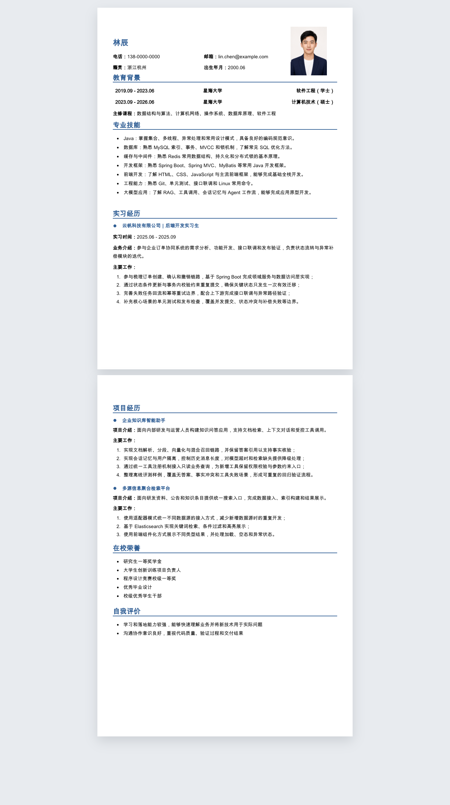
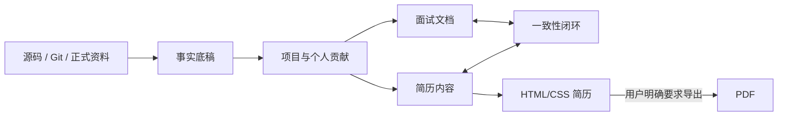

<div align="center">

# Prepare Resume & Interview

**把项目事实、面试表达与可交付简历连接成一条可追溯链路。**

[English](README_EN.md) · **简体中文**


</div>

`prepare-resume-and-interview` 是一个面向 Codex 的项目复盘、简历制作和面试准备 Skill。它先从源码、Git、正式资料和用户确认中建立事实底稿，再生成能够相互印证的项目面试文档与 HTML/CSS 简历。

它不是一个“把热门技术词填进模板”的简历生成器。没有证据的个人贡献、上线状态、业务规模和性能收益不会被写进简历。

## 实际生成效果

下图由仓库内置的 `classic-blue-a4` 模板真实构建并通过浏览器截图生成，不是另外绘制的宣传稿。示例中的人物、姓名、学校、公司和联系方式均为虚构数据；头像由 AI 生成，仅用于演示。



## 为什么选择它

| 能力 | 本项目 | 常见简历生成方式 |
|---|---|---|
| 事实可信度 | 对事实标记来源与 `F/R/P/U` 状态，未确认内容不会伪装成经历 | 容易根据岗位描述补写技术或数据 |
| 个人贡献 | 结合 Git 作者、分支、时间和身份别名确定职责边界 | 容易把团队成果全部写成个人成果 |
| 项目表达 | 把业务约束、技术动作和可验证结果压缩为可追问的项目要点 | 常停留在功能罗列和技术栈堆砌 |
| 面试一致性 | 简历亮点可以回溯到项目介绍、STAR 故事和连续追问 | 简历与面试答案经常是两套事实 |
| 排版工程 | 内容、模板和样式分离，明确 A4 边界与跨页排版规则 | 内容常被硬编码，修改后容易溢出或错页 |
| 隐私边界 | 公共模板只接受脱敏数据，私有模板与 Skill 仓库隔离 | 真实手机号、照片或公司信息可能进入公共模板 |
| 导出控制 | 默认只构建 HTML；只有用户明确要求时才导出 PDF | 经常自动产生多余文件或执行不必要的处理 |

## 能做什么

- **项目取证与复盘**：从源码、配置、DDL、测试和 Git 历史还原业务链路、架构边界与个人贡献。
- **面试资料沉淀**：生成可以脱离源码复习的项目介绍、设计取舍、失败边界、STAR 故事和连续追问。
- **简历制作与优化**：从事实底稿、旧简历或用户资料生成结构化的中文技术简历。
- **模板管理**：校验、复制、注册和升级可复用模板，同时隔离公共模板与真实个人信息。
- **PDF 简历复刻**：以参考 PDF 为视觉权威，重建可搜索、可维护的 HTML/CSS 模板。
- **一致性检查**：核对简历、面试文档、Git 证据、项目数据和技能表是否使用同一事实版本。

## 工作流



事实底稿采用四类状态：

- `F`：源码、Git、测试、配置或用户正式确认的事实；
- `R`：由多项事实推导的解释，需要保留依据；
- `P`：可讨论的改进方案，不能写成已经实现；
- `U`：职责、数据、上线状态或效果仍需本人确认。

简历只使用 `F` 和经确认可采用的 `R`。

## 快速开始

### 1. 安装到 Codex Skills

```bash
git clone https://github.com/BigDoggle/prepare-resume-and-interview.git \
  ~/.codex/skills/prepare-resume-and-interview
```

### 2. 执行环境预检

macOS / Linux：

```bash
cd ~/.codex/skills/prepare-resume-and-interview
sh scripts/preflight.sh --task resume
```

Windows PowerShell：

```powershell
cd $HOME\.codex\skills\prepare-resume-and-interview
powershell -ExecutionPolicy Bypass -File scripts\preflight.ps1 -Task resume
```

HTML 简历制作需要 Python 3.9+ 和 Node.js 18+。只有执行 PDF 导出或 PDF 复刻时，才额外检查 npm、Playwright 和 Chrome、Edge 或 Chromium。

### 3. 在 Codex 中调用

```text
使用 $prepare-resume-and-interview，根据我的旧简历和项目仓库，
为 Java 后端岗位生成一份两页中文简历。先展示 HTML，不要导出 PDF。
```

也可以直接提出项目复盘、模板管理或 PDF 复刻请求，Skill 会进入对应工作分支，只加载当前任务需要的规范。

## 模板使用

列出并校验内置模板：

```bash
python3 scripts/template_manager.py --templates-root assets/templates list
python3 scripts/template_manager.py --templates-root assets/templates validate
```

复制模板到自己的工作目录：

```bash
python3 scripts/template_manager.py \
  --templates-root assets/templates \
  clone \
  --id classic-blue-a4 \
  --destination /absolute/path/to/my-resume
```

构建 HTML：

```bash
cd /absolute/path/to/my-resume
npm run build
```

在用户明确要求后导出 PDF：

```bash
npm run pdf
```

## 简历工程结构

```text
resume/
├── assets/                 # 照片、图标与本地资源
├── content/resume.json     # 唯一内容事实源
├── src/template.mjs        # 语义 HTML 结构
├── src/styles.css          # 屏幕与打印样式
├── scripts/build.mjs       # HTML 构建
├── scripts/export-pdf.cjs  # PDF 导出
├── dist/index.html         # 构建后的简历
└── output/pdf/             # 用户明确要求后生成的 PDF
```

模板使用统一的页面尺寸、页边距、字号、行距和章节间距。内容放不下时优先移动完整语义块，不通过单页缩小字号或侵占页边距掩盖溢出。

## 仓库结构

```text
prepare-resume-and-interview/
├── SKILL.md                # Skill 入口、任务路由与事实边界
├── agents/openai.yaml      # Codex 展示信息与默认提示
├── assets/templates/       # 脱敏的公共简历模板
├── references/             # 各工作分支的详细规范
├── scripts/                # 环境预检与模板管理工具
└── docs/images/            # README 演示资产
```

## 隐私与事实边界

- 公共模板不得包含真实手机号、邮箱、个人照片、公司内网地址或客户数据。
- 真实个人简历应保存在 Skill 仓库之外的用户工作目录。
- 没有可靠证据时，不编造 QPS、日单量、百分比、生产收益或“主导”等强归属表述。
- PDF 默认不会自动生成；普通导出与完整视觉验收是两个独立动作。
- Skill 不会自行提交或推送代码，Git 操作需要用户明确授权。

## 设计参考

README 的信息组织参考了以下优秀开源项目：

- [Reactive Resume](https://github.com/amruthpillai/reactive-resume)：先展示产品效果，再说明特性、快速开始和技术边界；
- [JSON Resume / resume-cli](https://github.com/jsonresume/resume-cli)：结构化简历数据与清晰的命令速查；
- [Awesome README](https://github.com/matiassingers/awesome-readme)：强调截图、简洁价值主张和可立即执行的上手步骤。

本项目只借鉴信息架构和文档表达方式，简历流程、模板与代码均由本仓库独立维护。
