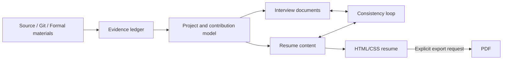

<div align="center">

# Prepare Resume & Interview

**Turn project evidence into interview-ready stories and production-ready resumes.**

**English** · [简体中文](README.md)


</div>

`prepare-resume-and-interview` is a Codex Skill for project reconstruction, resume production, and interview preparation. It builds an evidence ledger from source code, Git history, formal materials, and explicit user confirmations, then generates interview notes and HTML/CSS resumes that can be traced back to the same facts.

This is not a keyword-stuffing resume generator. Unverified ownership, launch status, business scale, or performance gains are kept out of the final resume.

## Real output

The image below was built by the repository's `classic-blue-a4` template and captured from the rendered browser page. It is not a separately designed marketing mockup. The person, name, school, company, and contact details are fictional; the portrait is AI-generated for demonstration only.


## Why this project

| Capability | This project | Typical resume generation |
|---|---|---|
| Factual integrity | Tracks source and `F/R/P/U` status; unresolved claims stay out | Often fills gaps from job descriptions or conventions |
| Contribution scope | Uses Git authors, refs, dates, and identity aliases to bound ownership | May turn team outcomes into individual claims |
| Project writing | Compresses constraints, technical actions, and verifiable outcomes into interviewable bullets | Often lists features and frameworks |
| Interview consistency | Resume highlights map back to project introductions, STAR stories, and follow-up questions | Resume and interview notes often drift apart |
| Layout engineering | Separates content, template, and styles with explicit A4 and pagination rules | Content is often hard-coded and breaks after edits |
| Privacy | Public templates contain sanitized data; private resumes stay outside the Skill repository | Personal contacts and photos may leak into shared templates |
| Export control | Builds HTML by default and exports PDF only after an explicit request | Often creates unnecessary artifacts automatically |

## What it can do

- **Project evidence and reconstruction** — recover business flows, architecture boundaries, and personal contributions from source, configuration, DDL, tests, and Git history.
- **Interview documentation** — produce standalone project introductions, design trade-offs, failure boundaries, STAR stories, and follow-up questions.
- **Resume production and optimization** — generate structured technical resumes from an evidence ledger, an existing resume, or user-provided materials.
- **Template management** — validate, clone, register, and version reusable templates while separating public assets from personal information.
- **PDF-to-template reconstruction** — use a reference PDF as visual authority and rebuild it as searchable, maintainable HTML/CSS.
- **Consistency review** — verify that resume claims, interview notes, Git evidence, project metrics, and listed skills share one factual version.

## Workflow



The evidence ledger uses four states:

- `F` — facts supported by source, Git, tests, configuration, or explicit confirmation;
- `R` — reasoned interpretations that retain their supporting evidence;
- `P` — possible improvements that must not be presented as implemented;
- `U` — ownership, metrics, launch status, or outcomes still awaiting confirmation.

Only `F` and confirmed `R` claims may enter a resume.

## Quick start

### 1. Install as a Codex Skill

```bash
git clone https://github.com/BigDoggle/prepare-resume-and-interview.git \
  ~/.codex/skills/prepare-resume-and-interview
```

### 2. Run the environment preflight

macOS / Linux:

```bash
cd ~/.codex/skills/prepare-resume-and-interview
sh scripts/preflight.sh --task resume
```

Windows PowerShell:

```powershell
cd $HOME\.codex\skills\prepare-resume-and-interview
powershell -ExecutionPolicy Bypass -File scripts\preflight.ps1 -Task resume
```

HTML resume production requires Python 3.9+ and Node.js 18+. npm, Playwright, and Chrome, Edge, or Chromium are checked only for PDF export and PDF reconstruction tasks.

### 3. Invoke it in Codex

```text
Use $prepare-resume-and-interview with my existing resume and project repository.
Create a two-page Chinese resume for a Java backend role. Show HTML first; do not export PDF.
```

You can also request project reconstruction, template management, or PDF replication directly. The Skill routes to the relevant workflow and loads only the instructions required for that task.

## Template commands

List and validate bundled templates:

```bash
python3 scripts/template_manager.py --templates-root assets/templates list
python3 scripts/template_manager.py --templates-root assets/templates validate
```

Clone a template into a working directory:

```bash
python3 scripts/template_manager.py \
  --templates-root assets/templates \
  clone \
  --id classic-blue-a4 \
  --destination /absolute/path/to/my-resume
```

Build HTML:

```bash
cd /absolute/path/to/my-resume
npm run build
```

Export PDF after an explicit user request:

```bash
npm run pdf
```

## Resume project structure

```text
resume/
├── assets/                 # Portraits, icons, and local assets
├── content/resume.json     # Single source of content truth
├── src/template.mjs        # Semantic HTML structure
├── src/styles.css          # Screen and print styles
├── scripts/build.mjs       # HTML build
├── scripts/export-pdf.cjs  # PDF export
├── dist/index.html         # Built resume
└── output/pdf/             # PDF created only after explicit request
```

Templates share one page size, margin system, font scale, line height, and section spacing. When content no longer fits, complete semantic blocks move to another page instead of shrinking one page or consuming its safety margins.

## Repository structure

```text
prepare-resume-and-interview/
├── SKILL.md                # Skill entry point, routing, and evidence rules
├── agents/openai.yaml      # Codex-facing metadata and default prompt
├── assets/templates/       # Sanitized public resume templates
├── references/             # Detailed workflow instructions
├── scripts/                # Environment and template utilities
└── docs/images/            # README demonstration assets
```

## Privacy and evidence boundaries

- Public templates must not contain real phone numbers, emails, portraits, internal company URLs, or customer data.
- Personal resumes belong in a user working directory outside the Skill repository.
- Without reliable evidence, the Skill does not invent QPS, transaction volume, percentages, production impact, or strong ownership verbs such as “led.”
- PDF output is opt-in. A normal export and a full visual audit are separate operations.
- The Skill never commits or pushes code without explicit user authorization.

## README inspiration

The information architecture of this README draws inspiration from:

- [Reactive Resume](https://github.com/amruthpillai/reactive-resume) — product-first screenshots followed by features, quick start, and technical boundaries;
- [JSON Resume / resume-cli](https://github.com/jsonresume/resume-cli) — structured resume data and concise command references;
- [Awesome README](https://github.com/matiassingers/awesome-readme) — clear value propositions, screenshots, and immediately actionable onboarding.

Only the documentation structure was used as inspiration. The workflow, templates, and implementation in this repository are maintained independently.
