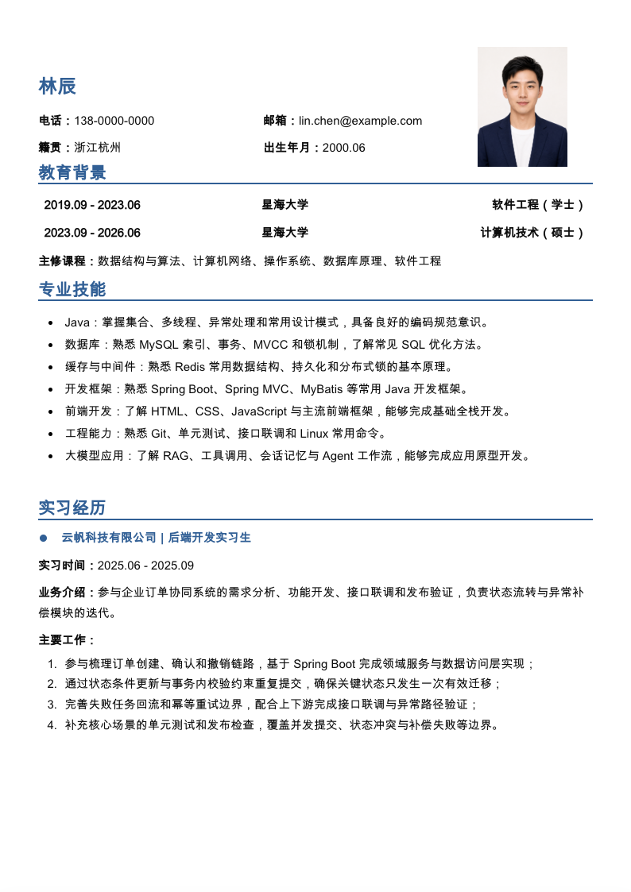
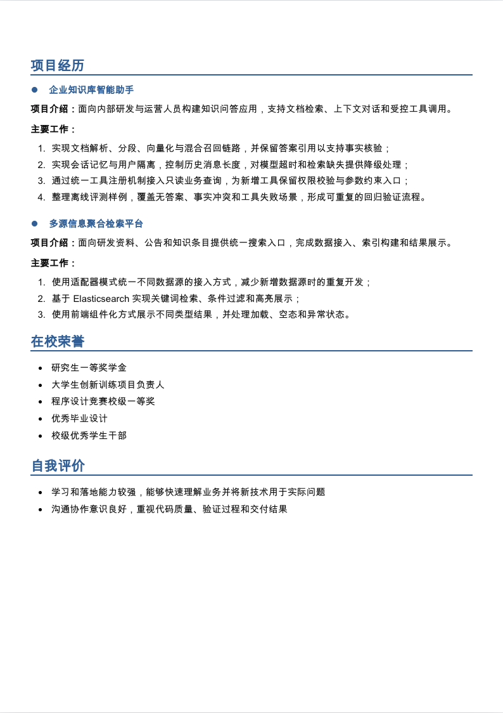

<div align="center">

# Prepare Resume & Interview

**Build the resume. Recover the story. Walk into the interview prepared.**

**English** · [简体中文](README.md)


</div>

Still staring at a blank resume?

You built real features, fixed ugly production bugs, and survived a long internship, yet every bullet somehow turns into “responsible for development.” Maybe you found a beautiful PDF template too, only to watch the entire page fall apart after changing one line.

Use this Skill and skip the blank page.

Bring your old resume, source code, Git history, or a design you like. It can turn scattered work into a structured resume, a clear internship summary, and interview material you can actually talk through. Review the HTML first; export PDF when you are ready.

## Features

| What you need | What the Skill does |
|---|---|
| A resume draft, fast | Reads an existing resume or personal history, applies a bundled template, and renders clean HTML |
| A stronger internship or project story | Inspects source, Git, tests, and documents to recover ownership, constraints, technical decisions, and outcomes |
| A template that looks like the PDF you saved | Rebuilds PDF, DOCX, or HTML/CSS references as maintainable templates instead of hiding a screenshot behind a page |
| Interview preparation that matches the resume | Reuses the same facts to create project introductions, STAR stories, trade-offs, and follow-up questions |

## What it looks like

Both pages below were rendered by the bundled `classic-blue-a4` template and captured directly from the browser. The identity, university, employer, and contact details are fictional. The portrait is AI-generated for the demo.

<p align="center">
  
  
</p>

## Why it is easier to work with

The Skill organizes your experience before drafting the resume. An old resume provides context, source files show the implementation, commits preserve the development history, and tests clarify edge cases. Together, they help recover the full project story, separate team scope from personal contribution, and identify what belongs on the page.

That keeps the story accurate during an interview. For a concurrency fix, the Skill records the state control, transaction checks, and regression coverage that were actually completed, then chooses wording that matches the evidence. Resume content, project introductions, and follow-up questions share the same evidence ledger, so each claim can be explained in detail.

The first handoff is HTML, making content, portraits, spacing, and page breaks easy to inspect. PDF export waits until you ask for it. A visual audit is available when the final file needs page-by-page checking.

## Quick start

### 1. Bring whatever you have

Any one of these is enough to begin:

- an old resume, personal history, or target role;
- source code, a Git repository, design notes, or tests;
- a PDF, DOCX, or HTML/CSS resume whose layout you like.

Missing numbers do not block the first draft. The Skill writes a conservative version and groups the open questions for confirmation instead of inventing data to fill the page.

### 2. Ask for the outcome

Build a resume:

```text
Use prepare-resume-and-interview with my old resume and project materials.
Create a two-page resume for a Java backend role. Show HTML first; do not export PDF.
```

Rebuild a design:

```text
Use prepare-resume-and-interview to rebuild the uploaded PDF as an HTML/CSS template.
Validate the layout with sanitized demo data before adding my information.
```

Recover a project story:

```text
Use prepare-resume-and-interview to inspect this repository and its Git history.
Summarize my internship and project work, then prepare STAR stories and interview questions.
```

### 3. Review HTML, then export

HTML is the default handoff. Once the content and layout look right, ask for PDF export. A normal export creates the file; a visual audit checks clipping, fonts, margins, and pagination.

## Evidence and claim boundaries

Every input enters an evidence ledger before it becomes a resume claim. Source, Git, configuration, tests, and explicit confirmation count as facts. Reasoned interpretations keep their supporting evidence. Future ideas stay in the future. Unconfirmed ownership, metrics, launch status, and impact wait for confirmation.

That evidence changes the verbs. “Led” and “owned” need stronger support than “implemented,” “improved,” or “contributed.” The goal is a resume that sounds good on paper and still makes sense after the interviewer asks, “What exactly did you do?”

## Install

The Skill is not tied to a specific Agent. If your client can load a skill directory or read `SKILL.md`, it can use this repository. The exact installation directory depends on the client.

```bash
git clone https://github.com/BigDoggle/prepare-resume-and-interview.git
```

Place the cloned repository in your client's skill directory, or ask the Agent to read the repository's `SKILL.md` directly.

HTML resume work needs Python 3.9+ and Node.js 18+. Run the preflight from the project directory:

```bash
sh scripts/preflight.sh --task resume
```

Windows PowerShell:

```powershell
powershell -ExecutionPolicy Bypass -File scripts\preflight.ps1 -Task resume
```

npm, Playwright, and Chrome, Edge, or Chromium are checked only when PDF export or PDF reconstruction needs them. The preflight reports missing capabilities; it does not install software or rewrite your PATH.

<details>
<summary><strong>Template commands and project layout</strong></summary>

Inspect, validate, and clone templates:

```bash
python3 scripts/template_manager.py --templates-root assets/templates list
python3 scripts/template_manager.py --templates-root assets/templates validate

python3 scripts/template_manager.py \
  --templates-root assets/templates \
  clone --id classic-blue-a4 \
  --destination /absolute/path/to/my-resume
```

Build HTML and export PDF after an explicit request:

```bash
cd /absolute/path/to/my-resume
npm run build
npm run pdf
```

Resume project:

```text
resume/
├── assets/                 # Portraits, icons, and local assets
├── content/resume.json     # Single source of content truth
├── src/template.mjs        # Semantic HTML structure
├── src/styles.css          # Screen and print styles
├── scripts/build.mjs       # HTML build
├── scripts/export-pdf.cjs  # PDF export
├── dist/index.html         # Generated resume
└── output/pdf/             # PDF created after explicit request
```

Repository:

```text
prepare-resume-and-interview/
├── SKILL.md                # Routing, evidence rules, and delivery policy
├── agents/openai.yaml      # Optional Agent interface metadata
├── assets/templates/       # Sanitized public templates
├── references/             # Project, resume, template, and PDF workflows
├── scripts/                # Preflight and template utilities
└── docs/images/            # README demo assets
```

</details>

## Privacy and operating boundaries

- Public templates contain no real phone numbers, emails, portraits, internal URLs, or customer data.
- Personal resume projects stay outside the Skill repository by default.
- PDF export is opt-in; a visual audit is a separate request.
- The Skill never commits or pushes code without explicit permission.

## License

This project is licensed under the [MIT License](LICENSE).
